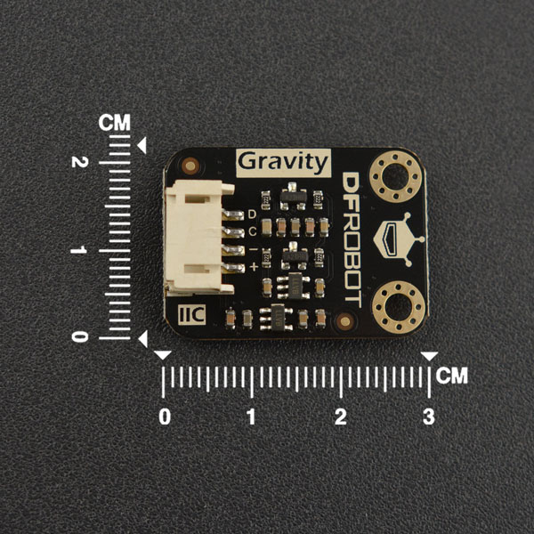

# DFRobot_PAJ7620

- [中文版](./README_CN.md)

The PAJ7620 integrates gesture recognition function with general I2C interface into a single chip forming an image analytic sensor system. It can recognize 9 human hand gesticulations such as moving up, down, left, right, forward, backward, circle-clockwise, circle-counter Key Parameters clockwise, and waving. It also offers built-in proximity detection in sensing approaching or departing object from the sensor. The PAJ7620 is packaged into module form in-built with IR LED and optics lens as a complete sensor solution. <br>
* PAJ7620U2-based gesture recognition sensor, high accuracy, long detecting distance(the distance on the datasheet is 0-15cm, but actually it's up to 20cm during our test).
* We expanded a slow detection mode with 2s recognition cycle. Besides the original 9 gestures, we specifically expanded four gesutres for this mode: slowly move left and right, slowly move up and down, slowly move forward and backward, wave slowly and randomly, which is very suitable for the beginners.  

<br>

<br>

## Product Link（https://www.dfrobot.com/product-2003.html）
    SKU：SEN0315
   
## Table of Contents

* [Summary](#summary)
* [Installation](#installation)
* [Methods](#methods)
* [Compatibility](#compatibility)
* [History](#history)
* [Credits](#credits)

## Summary

In this Arduino library, we will show you the basic usage of the PAJ7620 gesture sensor. You can experience the functions below using the built-in examples: 
  1. Read the 9 gestures' function in fast mode. 
  2. Read the function of the 9 basic gestures and 4 expanded gestures in slow mode.
  3. An example of gesture sequence recognition in fast mode, we call it gesture password.

## Installation

There are two ways to use the library:
1. Open the Arduino IDE, search for "DFRobot_BMX160" in Tools --> Manager Libraries on the status bar, and install the library.
2. First download the library file, paste it into the \Arduino\libraries directory, then open the examples folder and run the demo in that folder.

## Methods

```python
   def begin(self):
      '''!
         @brief init function
         @return return 0 if initialization succeeds, otherwise return non-zero. 
      '''

   def set_gesture_highrate(self,v):
      '''!
        @brief Set gesture detection mode 
        @param V true Set to fast detection mode, recognize gestures quickly and return. 
        @n  false Set to slow detection mode, system will do more judgements. 
        @n  In fast detection mode, the sensor can recognize 9 gestures: move left, right, up, down,
        @n  forward, backward, clockwise, counter-clockwise, wave. 
        @n  To detect the combination of these gestures, like wave left, right and left quickly, users need to design their own 
        @n  algorithms logic.
        @n  Since users only use limited gestures, we didn't integrate too much expanded gestures in the library. 
        @n  If necessary, you can complete the algorithm logic in the ino file by yourself.
        @n
        @n
        @n  In slow detection mode, the sensor recognize one gesture every 2 seconds, and we have integrated the expanded gestures 
        @n  inside the library, which is convenient for the beginners to use.
        @n  The slow mode can recognize 9  basic gestures and 4 expanded gestures: move left, right, up, down, forward, backward, 
        @n  clockwise, counter-clockwise, wave, slowly move left and right, slowly move up and down, slowly move forward and backward, 
        @n  wave slowly and randomly. 
      '''

   def gesture_description(self,gesture):
      '''!
        @brief Get the string descritpion corresponding to the gesture number.
        @param gesture Gesture number inlcuded in the eGesture_t
        @return Textual description corresponding to the gesture number:if the gesture input in the gesture table doesn't exist,
        @n return null string.
      '''
   
   def get_gesture(self):
      '''!
        @brief Get gesture
        @return Return gesture, could be any value except GESTURE_ALL in eGesture_t.
      '''
```

## Compatibility

* RaspberryPi Version

| Board        | Work Well | Work Wrong | Untested | Remarks |
| ------------ | :-------: | :--------: | :------: | ------- |
| RaspberryPi2 |           |            |    √     |         |
| RaspberryPi3 |     √     |            |          |         |
| RaspberryPi4 |           |            |    √     |         |

* Python Version

| Python  | Work Well | Work Wrong | Untested | Remarks |
| ------- | :-------: | :--------: | :------: | ------- |
| Python2 |     √     |            |          |         |
| Python3 |     √     |            |          |         |

## History

- 2021/10/20 - Version 1.0.1 released.
- 2019/07/16 - Version 1.0.0 released.

## Credits

Written by Alexander(ouki.wang@dfrobot.com), 2019. (Welcome to our [website](https://www.dfrobot.com/))

